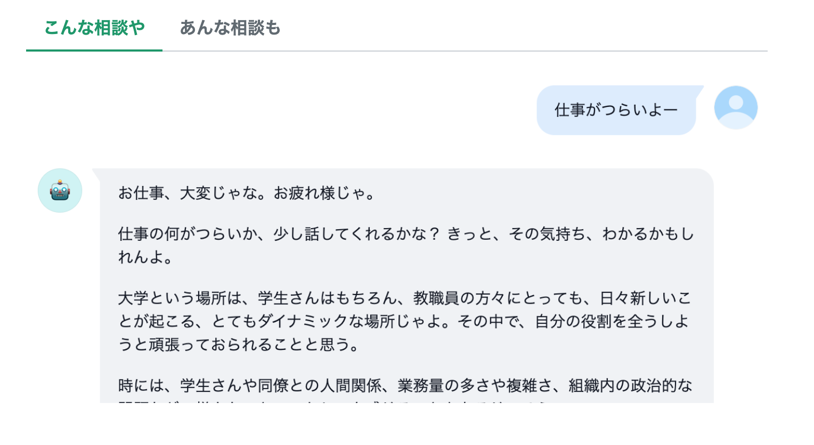
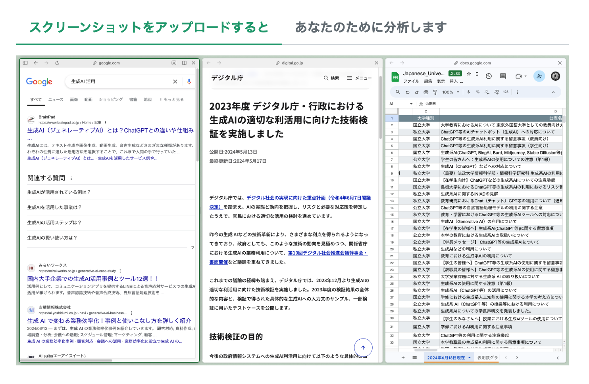
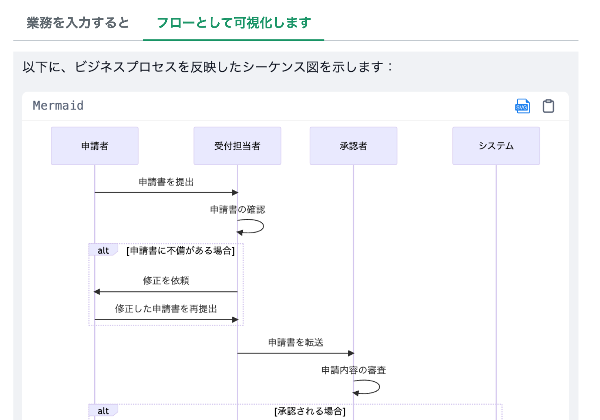
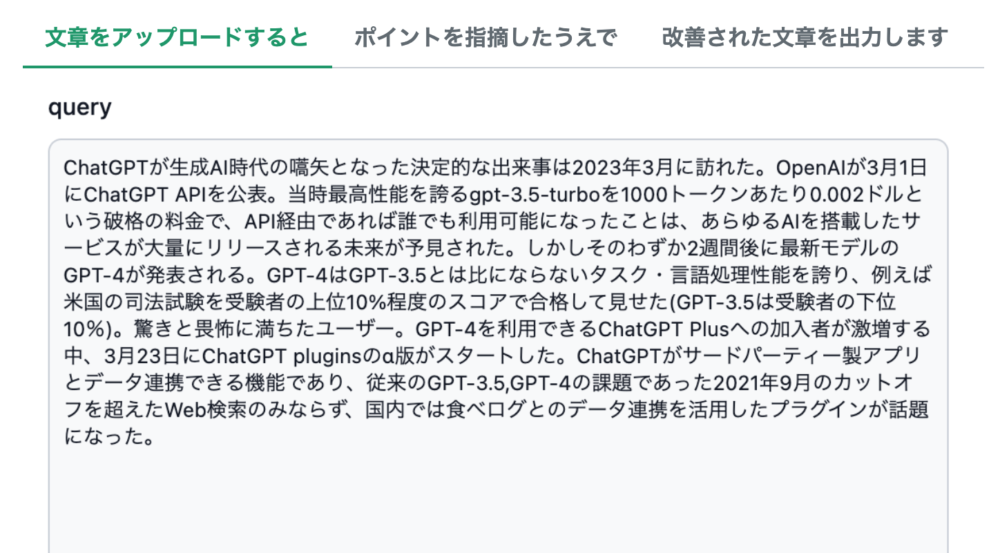

<!-- - Table of Content
{:toc} -->

## ABSTRACT

大学組織におけるシステム運用とデータ駆動型の意思決定支援、人材育成に従事。特に、データを情報として活用するための仕組みづくり、生成AIの活用による業務効率化と人材開発に注力し、九州大学および他大学のDXの推進を支援した。生成AIに関する豊富な知見と研修の企画・実施経験、データ分析の経験と、多様な関係者との協働実績を有する。

## PROFILE

| 項目        | 内容                  |
| ------------- | --------------------- |
| 氏名        | 森木 銀河             |
| 生年月日      | 1994年10月5日生まれ  |
| 学部        | 京都産業大学 理学部物理科学科 卒業 |
| 大学院        | 筑波大学大学院 教育研究科 理科教育コース 修了 |
| 主な資格        | 高等学校教諭専修免許状（理科）、3級知的財産管理技能士、G検定 |
| 主なスキル        | 生成AIコーディネート、データアナリティクス、業務効率化 |
| 趣味        | コーヒードリップ、読書、アート鑑賞、OSS開発、ollama |

* [LinkedIn](https://www.linkedin.com/in/gmoriki/){:target="_blank"}
* [Researchmap](https://researchmap.jp/gmoriki){:target="_blank"}

## CAREER MISSION

バックオフィスのAI活用を推進するために人材開発とユーザー体験をデザインし、多様な業務を担う職員によるDXを効果的に支援します。

## 職務経歴

### 学校法人五島育英会 (東京都市大学グループ)

| 期間        | 所属                  |　役職 |
| ------------- | --------------------- | --------------------- |
| 2019/04 - 2021/10        | 東京都市大学 世田谷キャンパス総務部管理課 |　専任事務職員　|

* 備品（物品資産）の管理・除却、決算報告資料作成
* 日常的な設備修繕やキャンパス環境保全
* 私立大学等経常費補助金（大型設備等運営支援に係る特別補助 等）申請
* 物品資産を管理する台帳システムの構築（台風被害による使用不能に伴う措置）
* 業務合理化のための自動化、データ集計方法の確立

■ 特筆すべき実績

* 物品資産に関するデータ集計、クリーニング、報告業務を担当。VBAを用いたデータ処理の自動化により、報告業務に係る時間を50%削減。
* 全学的なCS（Customer Satisfaction）推進プロジェクトのリーダーとして新入職員に対するアクティブラーニング型研修の企画・講師を担当。新入職員の組織社会化・定着率向上に貢献。

### 九州大学 インスティテューショナル・リサーチ室

| 期間        | 所属                  |　役職 |
| ------------- | --------------------- | --------------------- |
| 2021/11 -        | 九州大学 インスティテューショナル・リサーチ(IR)室 |　学術推進専門員　|

用語解説：

```markdown
Institutional Research(IR)...高等教育機関における意思決定や計画立案を支援するための情報収集・分析活動の総称  
学術推進専門員...九州大学において特殊性を有し高度かつ専門的な知識等を必要とする全学的な業務および研究活動業務を遂行する高度専門職
```

#### 全学的な業務活動

* 教員業績管理システム・研究者情報公開システムの保守・運用
    * 学内・学外システムとのデータ連携により教員の業績入力にかかる工数を削減
    * 教員業績管理システム・研究者情報システム・中期目標中期計画進捗管理システム、3システム同時リプレースプロジェクトのプロジェクトリーダー

* 学内研究分野ネットワーク可視化システムの構築・運用
    * 同システムの運用、ETLツールを活用した同データパイプラインの整備・自動化

* Python等を用いた分析業務・業務支援
    * 構造化データ・非構造化データの前処理、解析
    * ScivalAPIを利用した研究データ取得・加工
    * 過去の業務で用いられたPython、VBA遺物の解析・リファクタリング

* 教員の研究時間確保のためのエフォート分析
    * 全学アンケートを実施
    * 平均値差の検定・計量テキスト分析の可視化
    * 研究時間を確保できていない要因の特定

■ 特筆すべき実績

* Python,KHCoder,Tableauを用いたデータ分析により、教員が研究時間を確保できない要因を説明し、データ駆動イノベーション推進本部・業務DX推進部門の新設に貢献
* 教員業績管理システム等リプレースのプロジェクトリーダーとして教員業績データの移行や外部データ連携機能の運用を担当。教員の業績入力にかかる係る工数を削減

#### 研究活動・人材開発への貢献活動

* 学会等における研究活動
    * 九州大学の継続的なIR活動に資する開発や考察を学会や研究会で発表
    * 2023年5月時点で大学の生成AIポリシーを収集し、分析した結果を公表
    * 業務における生成AI利用の現状および展望に関する論考を寄稿

* 人材開発への貢献活動
    * 全国の大学で教育・研究・業務における生成AI利用に関する講演・研修 実績多数
    * 大学教職員職能開発FD、九州大学のDX人材育成に係る研修計画における生成AI研修を担当
    * 全国的なURA(大学における研究支援専門職)コミュニティにおけるPython勉強会 講師を担当
    * RA協議会支援 勉強会「生成AIとURA業務」 代表

* 2024年5月より愛媛大学 教育・学生支援機構 教育企画室のプロジェクトフェローを兼任。生成AIに関する教職員研修の企画や調査研究、教材作成にも従事。

■ 特筆すべき実績

* 生成AI技術の早期キャッチアップを経て、全国の国公私立大学で教職員の生成AI利用・活用のための研修、ガイドラインの策定支援を実施。延べ約2000人(2024年9月13日現在)の教職員に研修・講演を実施し、高い満足度を獲得。業務との関連度・有用度を高く評価されている

* 所属組織に留めず、生成AI活用や動向の知見を公開

## 研修実績

実績に加え、2024年度中に10以上の大学等での研修を予定。

用語解説：

```markdown
FDとSD...大学の教育・研究・運営の質を向上させるための研修活動。  
FD(Faculty Development)は主に大学教員を対象とした教育能力の向上や教育の質の改善を目指す活動であり、
SD(Staff Development)は大学職員の能力開発や資質向上を目指す活動である。
```

| 開催日 | 大学名等 | 研修名 | タイトル |
|---|---|---|---|
| 2023/07/11 | 文京学院大学 | 全学FD | 生成AI時代における大学の現在地を探る |
| 2023/09/29 | 愛媛大学 | 教育コーディネーター研修会 | 生成AI利用の本質的理解―大学の授業のために― |
| 2023/11/19 | 第12回大学情報・機関調査研究集会 | ワークショップ：「生成系AIとIRの可能性」 | 大学IRにおける生成AI利用の試み |
| 2023/12/06 | 愛媛大学 | 大学職員のための生成AIコーディネーター養成講座 | 大学業務における生成AI入門 |
| 2023/12/12 | 早稲田大学アカデミックソリューション | 大学業務ソリューションセミナー | 大学業務における生成AI利用の体系  |
| 2024/01/24 | 東京国際大学 | 全学FD研修会 | これからの授業と生成AI |
| 2024/02/05 | 北陸大学 | 職員研修 | ハンズオンで理解する生成AI |
| 2024/02/15 | 美作大学 | SD研修 | テキスト生成AIの基本 |
| 2024/02/28 | 北九州市立大学 | 全学FD研修 | 大学教育における生成AI利用の対応 |
| 2024/03/04 | 広島大学 | SD研修 | Copilotとして理解する生成AI利用の基本 |
| 2024/03/12 | 桐生大学 | FD/SD研修 | 大学教職員に必要な生成AI利用のリテラシー |
| 2024/03/21 | 大阪体育大学 | SD研修会 | 生成AIを活用できる大学教職員になる-基本と実践- |
| 2024/06/20 | 九州大学 | 大学教職員職能開発FD | 大学業務における生成AI活用の現在地 -基本編- |
| 2024/08/05 | 茨城大学 | FD研修会 | 大学教育における生成AI活用 入門 |
| 2024/08/20 | 九州大学 | 大学教職員職能開発FD | 大学業務における生成AI活用の現在地 -実践編- |
| 2024/08/27 | 日本マイクロソフト<br>佐賀大学 | 大学業務における生成AI利活用セミナー  | 大学職員は生成AIを「実際に」活用できるのか  |
| 2024/09/04 | 大学コンソーシアムひょうご神戸 | FD・SDセミナー「大学における生成AI活用について考える」 | 大学業務の観点から生成AI利用を考える |
| 2024/09/18 | 学校法人東放学園 | 教職員研修 | 業務のための画像/テキスト生成AI入門 |
| 2024/09/24 | 愛媛大学教育学生支援部 教育企画課 | 教職員研修 | 大学業務における生成AI活用 初級編 |
| 2024/09/26 | 北九州市立大学 | 全学FD研修会 | 大学教育における生成AI利用 実践編  |

# ポートフォリオ

## [研修スライド資料](https://speakerdeck.com/gmoriki/da-xue-ye-wu-niokerusheng-cheng-aihuo-yong-noxian-zai-di-ji-ben-bian){:target="_blank"}

九州大学FD「大学業務における生成AI活用の現在地 -基本編-」のスライド資料。AIを取り巻き変化する社会の中でAI利用者としての大学職員や大学組織に求められる認識や営為について、AI事業者ガイドラインをもとに説明。

## [動画教材](https://www.youtube.com/watch?v=PsNskvp_6t4&t=6s){:target="_blank"}

動画教材「大学業務における生成AI入門」。4回に分けて生成AI利用の初歩から組織的活用まで説明。

## [生成AIへの対応を表明した国内の大学一覧](https://note.com/pogohopper8/n/n3126b312f209){:target="_blank"}

国内で最も早く作成・公開された大学の生成AIポリシー一覧。[データベース版](https://docs.google.com/spreadsheets/d/1cDOqaIdu9JKOYuF0ThG33oixE09m210z/edit#gid=1530250804){:target="_blank"}も公開中。
東北大学のHPをはじめとする各所で引用されている。

被引用例：
[ChatGPT等の生成系AI利用に関する留意事項（教員向け）](https://olg.cds.tohoku.ac.jp/forstaff/ai-tools){:target="_blank"}

## [P4Us](https://promptforus.com/){:target="_blank"}

大学職員のためのプロンプトガイド。Prompt Guide for University staff。
2023年11月30より大学職員・大学教員が生成AIのリテラシーを身に着けるためのドキュメントプラットフォームを運用している。
チャットボット付きプロンプト集のほか、生成AIリテラシーを身につけるためのコンテンツを用意した。

## [AIプロダクト](https://promptforus.com/docs/products/){:target="_blank"}

非エンジニアである大学教員・職員がAIを活用するイメージを醸成するためのAIプロダクトをDifyに構築・無償公開中。成果の一部は[生成AI in 福岡 福岡生成AI 活用Meetup Vol.1](https://lu.ma/1q8ufp9q?locale=ja){:target="_blank"}にて公開し、XのDify日本公式アカウントに認知されている。

参考：

* [Difyを活用した「内省支援」エージェント開発の所感](https://speakerdeck.com/gmoriki/difywohuo-yong-sita-nei-sheng-zhi-yuan-ezientokai-fa-nosuo-gan){:target="_blank"}
* [Dify.AI Japan](https://x.com/DifyJapan/status/1838486924992090421)

### [何でも相談おじいさん](https://promptforus.com/docs/products/moderation-ai/){:target="_blank"}



> 大学職員としての経験が豊富なおじいさんの人格を持つAI会話アシスタントです。ユーザーとの対話を通じて、極端な考えに陥っていないかを確認し、より広い視野や相対化、対立する見方を提供します。完全に中立的な立場を取るのではなく、大学職員の立場から優しく共感しながら、異なる考えや習慣を持つ人々との共存について知恵を提供します。

### [デスクトップアナリスト](https://promptforus.com/docs/products/desktop-analyst/){:target="_blank"}



> ユーザーがアップロードしたスクリーンショットを分析し、ビジネス環境や作業状況に関する詳細な洞察を提供します。

### [業務フロー可視化ツール](https://promptforus.com/docs/products/bussiness-sequence/){:target="_blank"}



> ビジネスプロセスを視覚的なシーケンス図に自動変換するAIアシスタントツールです。ユーザーが入力したビジネスプロセスを解析し、関係する人物や部門、システムなどの参加者と、各ステップの流れを特定します。そして、これらの情報を基に、矢印や図形を使用した分かりやすい図表を生成します。

### [文章改善エージェント](https://promptforus.com/docs/products/precision-prose-polisher/){:target="_blank"}



> 文章校正と改善を支援するAIベースのツールです。ユーザーが入力した文章を分析し、接続詞や副詞の使用、論理構造、表現の自然さなどの観点から改善点を特定します。AIアシスタントが文章を段落ごとに詳細に検討し、より明確で読みやすい表現への修正案を提示します。

# 関連リンク

* [Researchmap](https://researchmap.jp/gmoriki){:target="_blank"}
* [SpeakerDeck](https://speakerdeck.com/gmoriki){:target="_blank"}
* [note](https://note.com/pogohopper8/){:target="_blank"}
* [GitHub](https://github.com/gmoriki){:target="_blank"}
* [LinkedIn](https://www.linkedin.com/in/gmoriki/){:target="_blank"}